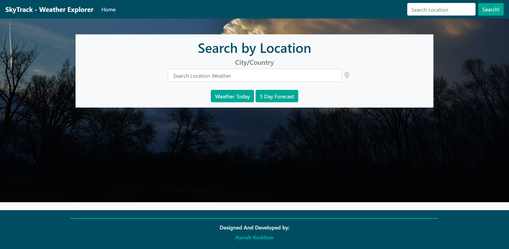

# SkyTrack

**SkyTrack** is a web application that delivers a 5-day weather forecast, powered by the OpenWeather API. With a user-friendly interface, it provides accurate weather information for any location worldwide.

---

## **How to Run the App**

1. Clone the repository to your local machine:
   ```bash
   git clone https://github.com/ayoubkoddam/Webstack-Portfolio-Project-Pitch
   
2. Navigate to the project directory:
   ```bash
   cd Webstack-Portfolio-Project-Pitch

3. Install the required dependencies:
   ```bash
   npm install

4. Start the application:
   ```bash
   npm start

5. The application will run on the provided URL or http://localhost:8080.

## Prérequis

Avant de démarrer l'application, assurez-vous d'avoir les éléments suivants installés :

1. **Dernière version d'un navigateur web moderne.**
2. **Node.js et npm.**  
   Vous pouvez télécharger Node.js depuis [leur site officiel](https://nodejs.org/).
3. **Installer http-server**  
   Utilisez la commande suivante pour installer http-server en tant que dépendance de développement :
   ```bash
   npm install http-server --save-dev


## Future Updates:
Integration of accurate geolocation for enhanced user experience.

## Technology Stack:
Frontend: HTML, CSS (Bootstrap), JavaScript
Backend: Node.js (npm for package management)
API: OpenWeather API

## Author:
[Ayoub KODDAM](https://github.com/ayoubkoddam)

## Show Your Support:
Leave a star ⭐️ to show your appreciation!
Fork and modify it to make it your own!
